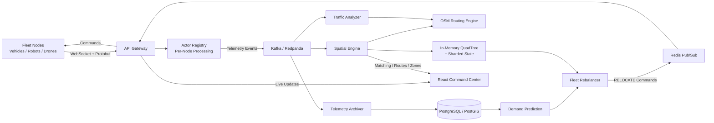

# Polaris: Real-Time IoT Fleet Orchestration Platform

Polaris is a **distributed, event-driven fleet orchestration platform** built to ingest and process high-frequency telemetry from large-scale IoT fleets, including autonomous vehicles, drones, robots, and logistics networks.

The platform combines **WebSocket-based telemetry ingestion, Kafka event streaming, an in-memory spatial engine, OpenStreetMap routing, and predictive fleet rebalancing** to maintain real-time fleet state, efficiently match nearby assets, analyze demand hotspots, and autonomously issue relocation commands. Polaris is designed as a practical exploration of **Distributed Systems, Event-Driven Architecture, Real-Time Spatial Processing, and IoT Fleet Orchestration**.

## The Core Concept

As logistics, ride-sharing, and drone delivery networks scale, they face a massive data bottleneck. Tens of thousands of vehicles continuously broadcast their GPS coordinates, speeds, and battery levels every second.

**The Polaris Solution:** Polaris flips this paradigm from *passive monitoring* to **active, real-time orchestration**. 
1. **Streaming-First:** Instead of writing directly to a database, Polaris catches data in a Redis Stream, acting as a massive shock absorber.
2. **Instant Spatial Awareness:** It feeds those coordinates into a custom, in-memory QuadTree (the "Brain"), bypassing database read-delays entirely. 
3. **Autonomous Action:** The system continuously evaluates the live map against predictive AI demand zones. When a geographic deficit is detected, Polaris doesn't wait for a human dispatcher; it instantly shoots a WebSocket `RELOCATE` directive back down to the idle physical hardware to pre-position the fleet.

Polaris isn't just a map showing where your fleet *is* it's an intelligent engine deciding where your fleet *needs to be*.

## Key Features

* **High-Throughput Ingestion Pipeline:** Utilizes **Redis Streams** as a "shock absorber" to decouple live WebSocket traffic from heavy database disk I/O.
* **Custom Spatial Engine:** A thread-safe, in-memory **QuadTree** algorithm written in Go enables lightning-fast geographical querying and exact Earth-curvature (Haversine) routing, bypassing slow database queries.
* **Event-Driven Microservices:** Completely decoupled architecture. The Edge Gateway handles WebSockets, while the Spatial Engine handles heavy compute. They communicate asynchronously via **Redis Pub/Sub**.
* **Autonomous Orchestration:** Evaluates live fleet density against spatial demand zones and dispatches physical `RELOCATE` directives directly to IoT hardware.
* **Predictive AI Clustering:** Uses SQL-based clustering on historical PostgreSQL data to predict future demand hotspots and pre-position fleet assets.
* **Live Command Center:** A **React/TypeScript** frontend featuring `Leaflet.js` map rendering, dynamic heatmaps, and `Chart.js` telemetry throughput monitoring.

## System Architecture



### High-Level Flow

```text
Fleet Node
    ↓
API Gateway
    ↓
Actor-Based Processing
    ↓
Kafka / Redpanda
    ↓
Spatial Engine
    ├── Live Spatial Indexing
    ├── Nearby Node Matching
    ├── Routing
    ├── Traffic Analysis
    └── Historical Persistence
            ↓
     Demand Prediction
            ↓
      Fleet Rebalancing
            ↓
       Redis Commands
            ↓
       Connected Nodes
```

---

# Key Features

## 1. Real-Time Telemetry Ingestion

Fleet nodes connect to Polaris through persistent **WebSocket connections**.

```http
GET /ws/telemetry
```

Nodes continuously publish information such as:

* Latitude and longitude
* Velocity
* Heading
* Node type
* Operational status
* Tenant ID

Telemetry uses **Protocol Buffers**, providing a compact and strongly typed binary format suitable for high-frequency IoT communication.

Polaris supports multiple spatial asset types, including:

* Bikes
* Autos
* Sedans
* SUVs
* Drones
* Robots
* Static sensors

---

## 2. Actor-Based Node Processing

The Gateway uses an **actor-based architecture** to isolate telemetry processing for individual nodes.

```text
Vehicle A → Actor A → Mailbox
Vehicle B → Actor B → Mailbox
Vehicle C → Actor C → Mailbox
```

Instead of allowing thousands of devices to continuously modify shared state, each node can be processed independently through its own actor.

This provides:

* Per-node message ordering
* Concurrency isolation
* Reduced shared-state contention
* Failure isolation
* Backpressure

Bounded actor mailboxes prevent unlimited message accumulation during periods of heavy load.

---

## 3. Event-Driven Telemetry Pipeline

Polaris uses **Kafka-compatible event streaming** to separate telemetry ingestion from downstream processing.

The local environment uses **Redpanda**, which provides Kafka-compatible APIs.

```text
Gateway
   ↓
Kafka / Redpanda
   ├── Spatial Engine
   ├── Telemetry Archiver
   └── Traffic Analyzer
```

Multiple consumers can process telemetry independently without slowing down the Gateway.

This keeps expensive operations such as database persistence and analytics outside the latency-sensitive ingestion path.

---

## 4. Real-Time Spatial Engine

The Spatial Engine maintains the latest state of the fleet entirely in memory.

It combines:

* **Sharded in-memory state**
* **Thread-safe QuadTree spatial indexing**

```text
Telemetry Update
      ↓
Sharded Node State
      ↓
QuadTree Update
      ↓
Live Spatial Index
```

Node state is distributed across multiple shards using the node ID, reducing lock contention when large numbers of nodes update concurrently.

The QuadTree provides efficient geographic candidate searches without repeatedly querying the historical database.

---

## 5. Nearby Vehicle Matching

Polaris provides a spatial matching API for finding nearby fleet assets.

```http
GET /api/v1/nodes/match
```

Matching can consider:

* Current location
* Search radius
* Tenant
* Requested asset type

The engine first uses the **QuadTree** to retrieve nearby candidates and then calculates the exact geographic distance using the **Haversine formula**.

```text
Search Location
      ↓
Bounding Box
      ↓
QuadTree Search
      ↓
Tenant / Type Filtering
      ↓
Haversine Distance
      ↓
Nearest Matching Nodes
```

This avoids performing an expensive full scan across the entire fleet.

---

## 6. OpenStreetMap Routing

Polaris contains a routing engine based on **OpenStreetMap (OSM)** road-network data.

The engine loads a `.osm.pbf` road network and constructs an in-memory routing graph.

```http
GET /api/v1/routes/calculate
```

The routing subsystem also contains safety and hysteresis mechanisms designed to reduce unstable route changes when traffic conditions fluctuate.

If the OSM graph cannot be loaded, the rest of the Spatial Engine can continue operating in a degraded mode.

---

## 7. Historical Telemetry Storage

Polaris separates real-time fleet state from historical telemetry.

```text
Live Fleet State
      ↓
Memory + QuadTree

Historical Telemetry
      ↓
PostgreSQL / PostGIS
```

Telemetry events are asynchronously archived into **PostgreSQL/PostGIS**.

Historical data can support:

* Fleet analytics
* Vehicle movement history
* Utilization analysis
* Demand analysis
* Future ML training pipelines

Because persistence happens asynchronously, database latency does not directly block telemetry ingestion.

---

## 8. Traffic Analysis

A dedicated stream consumer analyzes incoming telemetry and updates traffic information associated with the road network.

```text
Telemetry Stream
      ↓
Traffic Analyzer
      ↓
Road Network
      ↓
Routing Decisions
```

Traffic processing operates independently from the Gateway and other telemetry consumers.

---

## 9. Predictive Demand Zones

Polaris analyzes historical telemetry to identify geographic areas with high recent fleet activity.

```text
Historical Telemetry
       ↓
Geographic Grouping
       ↓
Activity Analysis
       ↓
High-Demand Areas
       ↓
Predicted Zones
```

Predicted zones are exposed through:

```http
GET /api/v1/zones/predicted
```

The current implementation acts as a **historical demand heuristic**, providing a baseline that can later be replaced by ML-based demand forecasting.

---

## 10. Autonomous Fleet Rebalancing

The Fleet Rebalancer combines predicted demand with the current spatial state of the fleet.

```text
Predicted Demand
       +
Current Fleet State
       ↓
Fleet Rebalancer
       ↓
Select Available Nodes
       ↓
RELOCATE Command
```

A relocation command can contain a target destination such as:

```json
{
  "directive": "RELOCATE",
  "target_lat": 13.0,
  "target_lon": 80.2
}
```

Demand calculation follows a **Strategy Pattern**, allowing different demand implementations to be plugged into the same rebalancer.

```text
Static Zones ───────┐
                    ↓
              DemandStrategy
                    ↓
               Rebalancer
                    ↑
Predictive Zones ───┘
```

This allows ML-based demand forecasting to be introduced later without redesigning the orchestration engine.

---

## 11. Redis Command Delivery

Polaris separates its telemetry pipeline from its real-time command pipeline.

### Kafka / Redpanda

Used for:

* Telemetry events
* Durable event streaming
* Independent consumers
* Historical processing

### Redis Pub/Sub

Used for:

* Low-latency commands
* Engine-to-Gateway communication
* Fleet relocation directives

Commands are published through:

```text
telemetry:commands
```

The Gateway receives the command and forwards it to the appropriate connected fleet node.

```text
Fleet Rebalancer
      ↓
Redis Pub/Sub
      ↓
API Gateway
      ↓
Node WebSocket
      ↓
Vehicle / Robot / Drone
```

---

## 12. Multi-Tenant Fleet Support

Every spatial object contains a:

```text
tenant_id
```

Spatial matching filters candidates by tenant before returning results.

This provides the foundation for multiple organizations or fleets to operate on shared infrastructure while maintaining logical isolation.

---

## 13. Command Center Dashboard

Polaris includes a **React + TypeScript** command center for monitoring the distributed fleet.

The frontend contains three primary views:

###  Spatial Map

Visualizes live fleet positions geographically using **Leaflet**.

###  Analytics

Displays operational and fleet metrics using **Chart.js**.

###  Swarm Tester

Provides a UI for testing and observing large groups of simulated fleet nodes.

Live fleet updates are delivered through:

```http
GET /ws/dashboard
```

---

# 🛠️ Technology Stack

| Area                        | Technologies            |
| --------------------------- | ----------------------- |
| **Backend**                 | Go, Gin                 |
| **Real-Time Communication** | WebSockets              |
| **Serialization**           | Protocol Buffers        |
| **Event Streaming**         | Kafka / Redpanda        |
| **Command Messaging**       | Redis Pub/Sub           |
| **Database**                | PostgreSQL, PostGIS     |
| **Spatial Processing**      | QuadTree, Haversine     |
| **Routing**                 | OpenStreetMap           |
| **Frontend**                | React, TypeScript, Vite |
| **Maps**                    | Leaflet                 |
| **Analytics**               | Chart.js                |
| **Infrastructure**          | Docker Compose          |

---

# 📂 Project Structure

```text
v3.0/
├── backend/
│   │
│   ├── api/proto/
│   │   └── v1/                 # Protobuf telemetry contracts
│   │
│   ├── cmd/
│   │   ├── gateway/            # WebSocket/API Gateway
│   │   ├── engine/             # Spatial & orchestration engine
│   │   └── loadtest/           # Fleet load generator
│   │
│   ├── internal/
│   │   │
│   │   ├── adapter/
│   │   │   ├── handler/        # HTTP/WebSocket handlers
│   │   │   └── repository/     # Stream/repository adapters
│   │   │
│   │   ├── application/
│   │   │   ├── spatial/        # Real-time spatial engine
│   │   │   ├── stream/         # Event consumers & archiver
│   │   │   └── orchestrator/   # Demand & fleet rebalancing
│   │   │
│   │   ├── core/
│   │   │   ├── actor/          # Actor-based node processing
│   │   │   ├── domain/         # Domain models
│   │   │   ├── ports/          # Core interfaces
│   │   │   └── routing/        # Routing safety logic
│   │   │
│   │   └── infra/
│   │       ├── osm/            # OpenStreetMap loader
│   │       ├── postgres/       # PostgreSQL adapter
│   │       └── redis/          # Redis command client
│   │
│   ├── deployments/
│   │   ├── docker-compose.yml
│   │   └── init.sql
│   │
│   └── data/                   # OSM / geospatial data
│
└── frontend/
    └── src/
        ├── pages/
        │   ├── MapDashboard.tsx
        │   ├── Analytics.tsx
        │   └── SwarmTester.tsx
        └── ...
```

---

#  Main Interfaces

| Interface                         | Purpose                           |
| --------------------------------- | --------------------------------- |
| `GET /ws/telemetry`               | Fleet node telemetry WebSocket    |
| `GET /ws/dashboard`               | Live dashboard WebSocket          |
| `GET /api/v1/nodes/match`         | Find nearby fleet nodes           |
| `GET /api/v1/routes/calculate`    | Calculate a road route            |
| `GET /api/v1/zones/predicted`     | Retrieve predicted demand zones   |
| `GET /api/v1/metrics/connections` | View active telemetry connections |

---

# 🚀 Running Locally

## Prerequisites

Make sure the following are installed:

* Go
* Node.js & npm
* Docker
* Docker Compose

---

## 1. Start Infrastructure

```bash
cd v3.0/backend

docker compose -f deployments/docker-compose.yml up -d
```

This starts:

```text
Redpanda
Redis
PostgreSQL / PostGIS
```

---

## 2. Start the API Gateway

```bash
go run ./cmd/gateway
```

The Gateway handles fleet WebSocket connections, telemetry ingress, and command delivery.

---

## 3. Start the Spatial Engine

Open another terminal:

```bash
go run ./cmd/engine
```

The engine initializes:

* Spatial state
* QuadTree indexing
* Telemetry consumers
* Routing
* Historical archiving
* Traffic analysis
* Demand prediction
* Fleet rebalancing

---

## 4. Start the Frontend

```bash
cd v3.0/frontend

npm install
npm run dev
```

---

## 5. Run the Load Tester

```bash
cd v3.0/backend

go run ./cmd/loadtest
```

The load tester can simulate large numbers of fleet nodes to evaluate telemetry throughput and connection handling.

---

# 🧠 Design Overview

Polaris separates the platform into several logical planes:

```text
┌─────────────────────────────┐
│      Connection Plane       │
│     WebSockets + Actors     │
└──────────────┬──────────────┘
               ↓
┌─────────────────────────────┐
│         Event Plane         │
│     Kafka / Redpanda        │
└──────────────┬──────────────┘
               ↓
┌─────────────────────────────┐
│   Real-Time State Plane     │
│ Sharded Memory + QuadTree   │
└──────────────┬──────────────┘
               ↓
┌─────────────────────────────┐
│     Persistence Plane       │
│ PostgreSQL / PostGIS        │
└──────────────┬──────────────┘
               ↓
┌─────────────────────────────┐
│       Decision Plane        │
│ Prediction + Rebalancing    │
└──────────────┬──────────────┘
               ↓
┌─────────────────────────────┐
│        Command Plane        │
│       Redis Pub/Sub         │
└─────────────────────────────┘
```

The complete lifecycle is:

```text
Connect
   ↓
Send Telemetry
   ↓
Process Concurrently
   ↓
Stream Events
   ↓
Update Spatial State
   ↓
Match / Route
   ↓
Archive History
   ↓
Analyze Demand
   ↓
Rebalance Fleet
   ↓
Send Commands
```

---

## 📌 About

Polaris is an engineering project exploring how **distributed systems, real-time IoT telemetry, spatial algorithms, event-driven processing, and autonomous fleet orchestration** can be combined into a scalable fleet-management platform.

